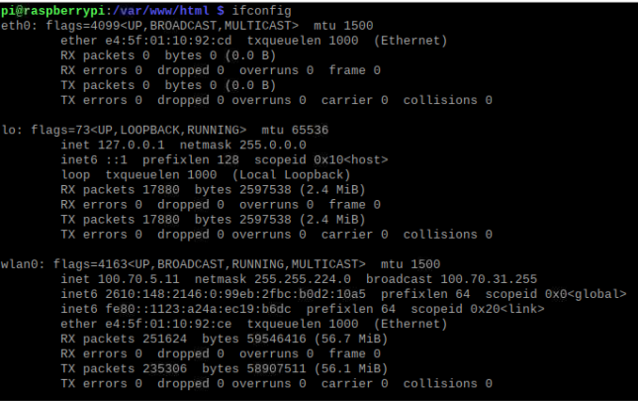
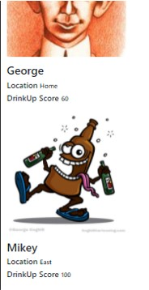
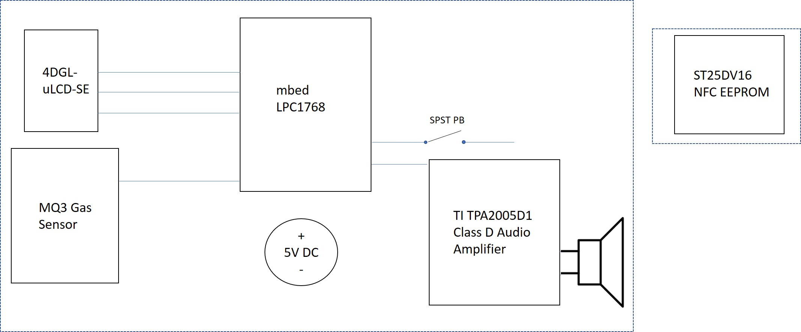

# DrinkUp - A Breathalyzer Social Media Web App

#### Team Members: Harsh Chakhaiyar and Miguel Garcia

## Summary
Face it: COVID-19 has sucked out the fun of drinking with your friends due to social distancing. As a college kid however, I was stuck wondering: <i>How am I going to get peer pressured to drink without my friends being a bad influence on me?</i> Well, fear no more Fraternity brothers! <b>DrinkUp</b> is a social media web app that allows you to link your "DrinkUp Score" (proprietary score based on your BAC) to the internet for all of your friends and family to admire!

By simply following the steps below, you too can create your own DrinkUp system.

Using the system is super easy. Simply power on the device and begin blowing once the 10 second timer begins. Afterwards, simply tap the NFC chip to your cell phone in order to open up the web app (no download needed!). You can input your "DrinkUp Score" once on the page, and you can compare it with your friends!


## Equipment Needed:

Listed below is the equipment needed as well as links to find the equipment.

1. Arm mbed LPC1768
https://www.sparkfun.com/products/9564

2. Raspberry Pi 4
https://www.raspberrypi.org/products/raspberry-pi-4-model-b/

3. Adafruit Speaker
https://www.sparkfun.com/products/11089

4. Adafruit TI TPA2005D1 Class D Amp Audio Amplifier
https://www.sparkfun.com/products/11044

5. uLCD-144-G2 128
https://www.sparkfun.com/products/11377

6. ST25DV16 NFC EEPROM
https://www.adafruit.com/product/4701

7. SPST Pushbutton
https://www.sparkfun.com/products/9190

8. 5V DC External + Adapter
https://www.adafruit.com/product/276?gclid=Cj0KCQjwvr6EBhDOARIsAPpqUPGUF7L0BTAu3z72EmdP19luXJz4_eb1P8Igce8QNPqRT0DSoBjZFH4aApjyEALw_wcB
https://www.adafruit.com/product/373

9. Breadboard and Jumper Wires

10. MQ3 Gas Sensor + Breakout
https://www.sparkfun.com/products/8880
https://www.sparkfun.com/products/8891

11. 10 KOhm Resistor


## Development steps:

### 0. Acquire all of the parts. 

There are essentially 3 subsystems to this project: 
    1) A Raspberry Pi 4 subsystem where we configure a server and serve PHP files
    2) an MBED which will be gathering data 
    3) 3) the actual website which will take in user input via a mobile optimized web-app.

### 1. Boot up Raspberry Pi and connect it to a WiFI network

The Raspberry Pi 4 takes in 5V and uses USB-C connection. You can power it through your laptop, but there might be warnings about undervoltage.

If you are on GT servers, you will have to connect it to GTother through the GT LAWN website. In order to find the MAC and IP address for the Raspberry Pi, simply use the command ```ifconfig```. You can take the MAC address and the IP address from under ```wlan0``` if you are using Wireless LAN. The MAC address will be next to ```ether``` and the IP address will be next to ```inet```.

In our case, the IP address used was ```100.70.5.11```.




Once the Raspberry Pi and your device are connected to the same Wifi network (ie GTother), you can enable VNC Viewer if you'd like to go headless. You need to enable this on the Raspberry Pi by going to ```Preferences``` > ```Raspberry Pi Configuration``` > ```Interfaces``` and then enabling VNC.

### 2. Setup Raspberry Pi LAMP Server.

- First, install Apache2 on the Raspberry Pi. This will allow your Raspberry Pi to run a LAMP (Linux, Apache, MySQL, PHP) server. 
```
pi@raspberrypi:~ $ sudo apt update && sudo apt upgrade -y
pi@raspberrypi:~ $ sudo apt install apache2 -y
```
To verify:
```
pi@raspberrypi:~ $ cd /var/www/html
pi@raspberrypi:/var/www/html $ ls -al

index.html
```
The ```/var/www/html``` directory is where we'll be doing most of the work. 

- Secondly, we need to install PHP on the Raspberry Pi for our dynamic website we will be building.
```
pi@raspberrypi:/var/www/html $ sudo apt install php -y
```
Now remove the pre-built ```index.html``` file and replace it with ```index.php``` to test the PHP installation.

```
pi@raspberrypi:/var/www/html $ sudo rm index.html
pi@raspberrypi:/var/www/html $ sudo nano index.php
```
Inside of ```index.php```...
```
<?php echo "hello world"; ?>
```
On nano, you can save your file by simply pressing <b>Ctrl+S</b>. To escape, use <b>Ctrl+X</b>.

We're actually not going to be using this file, so we can remove it.
```
pi@raspberrypi:/var/www/html $ sudo rm index.php
```

- Thirdly, we need to install MySQL onto the Raspberry Pi.
```
pi@raspberrypi:/var/www/html $ sudo apt install mariadb-server php-mysql -y
pi@raspberrypi:/var/www/html $ sudo service apache2 restart
pi@raspberrypi:/var/www/html $ sudo mysql_secure_installation
```
For the secure installation, you can answer Y for every yes/no question.

If you get an error, run this to create a new user. The credentials will be ```admin``` for the username and ```your_password``` for the password.
```
pi@raspberrypi:/var/www/html $ sudo mysql --user=root --password
> create user admin@localhost identified by 'your_password';
> grant all privileges on *.* to admin@localhost;
> FLUSH PRIVILEGES;
> exit;
```

- Fourthly, install phpMyAdmin on the Raspberry Pi to simplify your life when dealing with your MySQL.
```
pi@raspberrypi:/var/www/html $ sudo apt install phpmyadmin -y
```
When prompted:
- Select <b> Apache2 </b> and <b>Enter</b>
- Configuring <b>phpmyadmin</b>? <b>OK</b>
- Configure database for phpmyadmin with <b>dbconfig-common? Yes </b?
- Type your password and press <b>OK</b>

Restart Apache server.
```
pi@raspberrypi:/var/www/html $ sudo phpenmod mysqli
pi@raspberrypi:/var/www/html $ sudo service apache2 restart
```
And make sure that the ```phpmyadmin``` folder is in the ```/var/www/html/``` directory.


### 3. Populate SQL database on PHPMyAdmin on PI's localhost

Go to ```localhost``` if you are on the Pi or ```IP Address``` if you are on the same network. Create a database and name it ```esp_data```.

Create a table named ```SensorData``` by using the following SQL query on the web UI with the following columns:

```
    id INT(6),
    sensor DOUBLE,
    User TEXT,
    Location TEXT,
    Active tinyint(1)
```
You can set Default values as well.

### 4. Create a webpage to display database content.

Create a PHP file that will display the content on a webpage.
```
pi@raspberrypi:~ $ nano /var/www/html/esp-data.php
```

This will be used as the main page of the web app. Note that the images will not load until you add your own to the Pi as well.

```php
<?php

  $servername = "localhost";

  $dbname = "esp_data";

  $username = "admin";

  $password = "your_password";

  // Create connection
  $conn = new mysqli($servername, $username, $password, $dbname);
  // Check connection
  if ($conn->connect_error) {
      die("Connection failed: " . $conn->connect_error);
  } 


$sql_update = "UPDATE `SensorData` SET `Active` = '1' WHERE `SensorData`.`User` = '" . $_GET['User'] ."';";
$conn->query($sql_update);

$sql_update = "UPDATE `SensorData` SET `SensorData`.`Location` = '" . $_GET['Location'] ."' WHERE `SensorData`.`User` = '" . $_GET['User'] ."';";
$conn->query($sql_update);
$sql_update = "UPDATE `SensorData` SET `SensorData`.`sensor` = '" . $_GET['sensor'] ."' WHERE `SensorData`.`User` = '" . $_GET['User'] ."';";
$conn->query($sql_update);

$sql_update = "UPDATE `SensorData` SET `Active` = '0' WHERE `SensorData`.`User` != '" . $_GET['User'] ."';";
  if($conn->query($sql_update)  != TRUE){
        echo '
                error
        ';
  }


?>

<!DOCTYPE html>
<html>

<head>
  <meta charset="UTF-8">
  <meta name="viewport" content="width=device-width, initial-scale=1.0">
  <meta http-equiv="X-UA-Compatible" content="ie=edge">
  <link rel="stylesheet" href="https://stackpath.bootstrapcdn.com/bootstrap/4.4.1/css/bootstrap.min.css"
    integrity="sha384-Vkoo8x4CGsO3+Hhxv8T/Q5PaXtkKtu6ug5TOeNV6gBiFeWPGFN9MuhOf23Q9Ifjh" crossorigin="anonymous">
  <title>DrinkUp</title>
  <link rel="stylesheet" href="https://pro.fontawesome.com/releases/v5.10.0/css/all.css"
    integrity="sha384-AYmEC3Yw5cVb3ZcuHtOA93w35dYTsvhLPVnYs9eStHfGJvOvKxVfELGroGkvsg+p" crossorigin="anonymous" />
</head>

<body>
  <?php


  $sql = "SELECT id, sensor, User, Location  FROM SensorData";

  echo '
        <!-- Page Heading -->
        <h1 class="my-4">DrinkUp
          <small>My Friends</small>
          <i class="fa fa-cog" aria-hidden="true" style="float:right;"></i>
        </h1>
  '; 

  if ($result = $conn->query($sql)) {
    while ($row = $result->fetch_assoc()) {
      $row_id = $row["id"];
      $row_sensor = $row["sensor"];
      $row_location = $row["Location"];
      $row_user = $row["User"];
      $row_active = $row["Active"];

      echo '
      <div class="container">
          <!-- Friends -->
        <div class="row">
            <div class="col-md-7">
                <a href="#">
                    
                </a>
            </div>
            <div class="col-md-5">
      ';
      if ($row_user == $_POST['User']){
        echo '
                  <h3 style="color:red">' . $row_user .'</h3>
        ';
      }
      else{
        echo '
                  <h3>' . $row_user .'</h3>
        ';
      }
      echo '
                <h3 style="font-size: 20px;">Location <span style="font-size: 16px;">' . $row_location .'</span></h3>
                <h3 style="font-size: 20px;">BAC <span style="font-size: 16px;">' . $row_sensor .'</span></h3>
              </div>
        </div>
      </div>
      ';

    }
    $result->free();
  }


  $conn->close();
  ?>
  <script src="https://code.jquery.com/jquery-3.4.1.slim.min.js"
    integrity="sha384-J6qa4849blE2+poT4WnyKhv5vZF5SrPo0iEjwBvKU7imGFAV0wwj1yYfoRSJoZ+n"
    crossorigin="anonymous"></script>
  <script src="https://cdn.jsdelivr.net/npm/popper.js@1.16.0/dist/umd/popper.min.js"
    integrity="sha384-Q6E9RHvbIyZFJoft+2mJbHaEWldlvI9IOYy5n3zV9zzTtmI3UksdQRVvoxMfooAo"
    crossorigin="anonymous"></script>
  <script src="https://stackpath.bootstrapcdn.com/bootstrap/4.4.1/js/bootstrap.min.js"
    integrity="sha384-wfSDF2E50Y2D1uUdj0O3uMBJnjuUD4Ih7YwaYd1iqfktj0Uod8GCExl3Og8ifwB6"
    crossorigin="anonymous"></script>

</body>

</html>

```
To see if it works, go to:
```
http://Your-Raspberry-Pi-IP-Address/esp-data.php
```

Now we're going to want to make a cool ```Login``` page so we can allow for multiple users on our social media app.

```sudo nano login.php```

```php
<!DOCTYPE html>
<html lang="en">

<head>
    <meta charset="UTF-8">
    <meta name="viewport" content="width=device-width, initial-scale=1.0">
    <meta http-equiv="X-UA-Compatible" content="ie=edge">
    <link rel="stylesheet" href="https://stackpath.bootstrapcdn.com/bootstrap/4.4.1/css/bootstrap.min.css"
        integrity="sha384-Vkoo8x4CGsO3+Hhxv8T/Q5PaXtkKtu6ug5TOeNV6gBiFeWPGFN9MuhOf23Q9Ifjh" crossorigin="anonymous">
    <title>DrinkUp</title>
    <link rel="stylesheet" href="https://pro.fontawesome.com/releases/v5.10.0/css/all.css"
        integrity="sha384-AYmEC3Yw5cVb3ZcuHtOA93w35dYTsvhLPVnYs9eStHfGJvOvKxVfELGroGkvsg+p" crossorigin="anonymous" />

</head>
<?php
$servername = "localhost";

$dbname = "esp_data";
$username = "admin";
$password = "your_password";

// Create connection
$conn = new mysqli($servername, $username, $password, $dbname);
// Check connection
if ($conn->connect_error) {
    die("Connection failed: " . $conn->connect_error);
} 

$sql = "SELECT id, sensor, User, Location FROM SensorData";

?>


<body>


    <!-- Page Content -->
    <div class="container">

        <!-- Page Heading -->
        <h1 class="my-4">DrinkUp
            <i class="fa fa-cog" aria-hidden="true" style="float:right;"></i>
        </h1>

        <form action="esp-data.php" method="get">

            <!-- Select User -->
            <label for="User">Select User</label>
            <select id="User" name="User">
            <?php
                    if ($result = $conn->query($sql)) {
                        while ($row = $result->fetch_assoc()) {
                            $row_user = $row["User"];
                            echo '
                                <option value="' . $row_user .'">' . $row_user .' </option>
                            ';
                        }
                        $result->free();
                    }
                    $conn->close();
                    ?>
            </select>


            <!-- Score + Location Input-->
            <br>
            <label for="score">DrinkUp Score</label>
            <input type="text" class="form-control" name="sensor">
            <br>
            <label for="location">Location</label>
            <input type="text" class="form-control" name="Location" placeholder="Enter your Location! (Optional)">
            <br>

            <!-- Login Button -->
            <button type="submit" class="btn btn-info px-3"> 
                <i class="fas fa-beer"
                aria-hidden="true"></i> DrinkUp!
            </button>

        </form>

    </div>
    <!-- /.container -->
    <script src="https://code.jquery.com/jquery-3.4.1.slim.min.js"
        integrity="sha384-J6qa4849blE2+poT4WnyKhv5vZF5SrPo0iEjwBvKU7imGFAV0wwj1yYfoRSJoZ+n"
        crossorigin="anonymous"></script>
    <script src="https://cdn.jsdelivr.net/npm/popper.js@1.16.0/dist/umd/popper.min.js"
        integrity="sha384-Q6E9RHvbIyZFJoft+2mJbHaEWldlvI9IOYy5n3zV9zzTtmI3UksdQRVvoxMfooAo"
        crossorigin="anonymous"></script>
    <script src="https://stackpath.bootstrapcdn.com/bootstrap/4.4.1/js/bootstrap.min.js"
        integrity="sha384-wfSDF2E50Y2D1uUdj0O3uMBJnjuUD4Ih7YwaYd1iqfktj0Uod8GCExl3Og8ifwB6"
        crossorigin="anonymous"></script>

</body>

</html>

```

You can actually go to the ```phpmyadmin``` page and see the values change once you've logged in!

### 5. Add images to the RPI4 server. In the code we created a directory named ```img/img/``` and named each file after a user in the database.

After everything's done, here's an example of how the application will look like on your phone!

Login Page:


Friends Page:


That's everything for the Raspberry Pi 4. Now we can move onto the MBED.

### 6. Wire a breadboard for the MBED with the parts listed in the following schematic.

Below is an image showing all the devices used and their relative pins in the software. Note that we supply an external 5V power to the speaker, and there is an NFC chip that is not wired to anything (standalone).


And here is a simplified block diagram of the circuit.


For the MQ3 Gas Sensor, you will need to solder both the PCB (separate from the sensor) and a 10K ohm resistor. The gas sensor can be soldered in any configuration that fits onto the PCB.

### 7. Once all parts are connected, compile and run the following files on the MBED

### 8. Let the MBED stay on for at least 1 hour.

This allows for the alcohol gas sensor to warm up.

### 9. Use the NFC Tools App to configure the NFC.
  
  Select ```Write``` > ```Add a record``` > ```URL```.
  
  Afterwards, use the following as your URL:
  
  ```http://Rasberry-Pi's-IP-Address/login.php``` 
  
  Simply contact the NFC chip with your phone for a few seconds, and it should write that URL to the tag. Now whenever your phone touches that tag for a few seconds, it will pull up the website login page automatically! How cool is that?

## Project Demo

## Presentation
